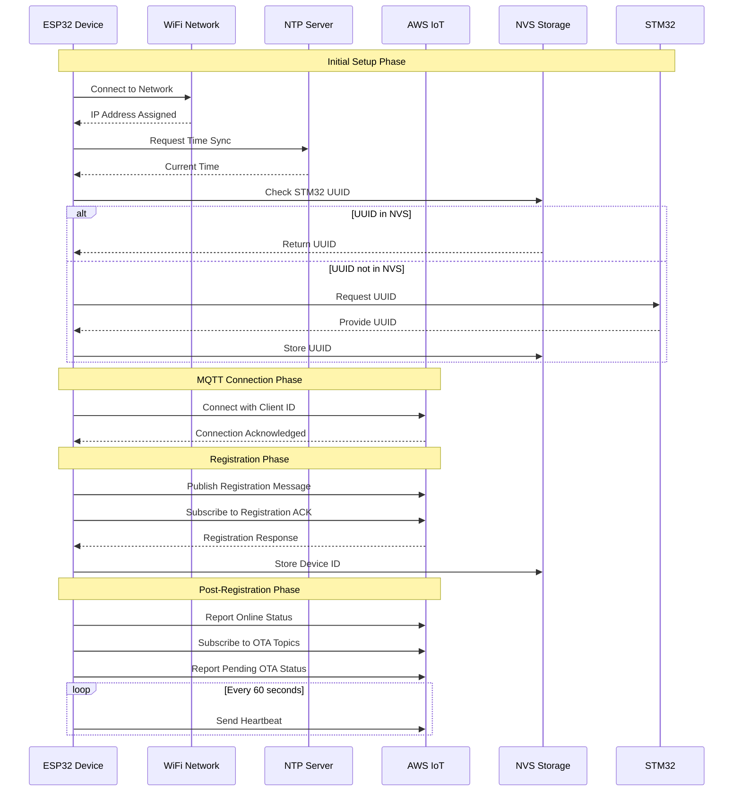

```mermaid
sequenceDiagram
    participant Device as ESP32 Device
    participant WiFi as WiFi Network
    participant NTP as NTP Server
    participant MQTT as AWS IoT
    participant NVS as NVS Storage
    participant STM32 as STM32

    Note over Device,STM32: Initial Setup Phase
    Device->>WiFi: Connect to Network
    WiFi-->>Device: IP Address Assigned
    Device->>NTP: Request Time Sync
    NTP-->>Device: Current Time
    Device->>NVS: Check STM32 UUID
    alt UUID in NVS
        NVS-->>Device: Return UUID
    else UUID not in NVS
        Device->>STM32: Request UUID
        STM32-->>Device: Provide UUID
        Device->>NVS: Store UUID
    end

    Note over Device,MQTT: MQTT Connection Phase
    Device->>MQTT: Connect with Client ID
    MQTT-->>Device: Connection Acknowledged

    Note over Device,MQTT: Registration Phase
    Device->>MQTT: Publish Registration Message
    Device->>MQTT: Subscribe to Registration ACK
    MQTT-->>Device: Registration Response
    Device->>NVS: Store Device ID

    Note over Device,MQTT: Post-Registration Phase
    Device->>MQTT: Report Online Status
    Device->>MQTT: Subscribe to OTA Topics
    Device->>MQTT: Report Pending OTA Status
    loop Every 60 seconds
        Device->>MQTT: Send Heartbeat
    end
``` 