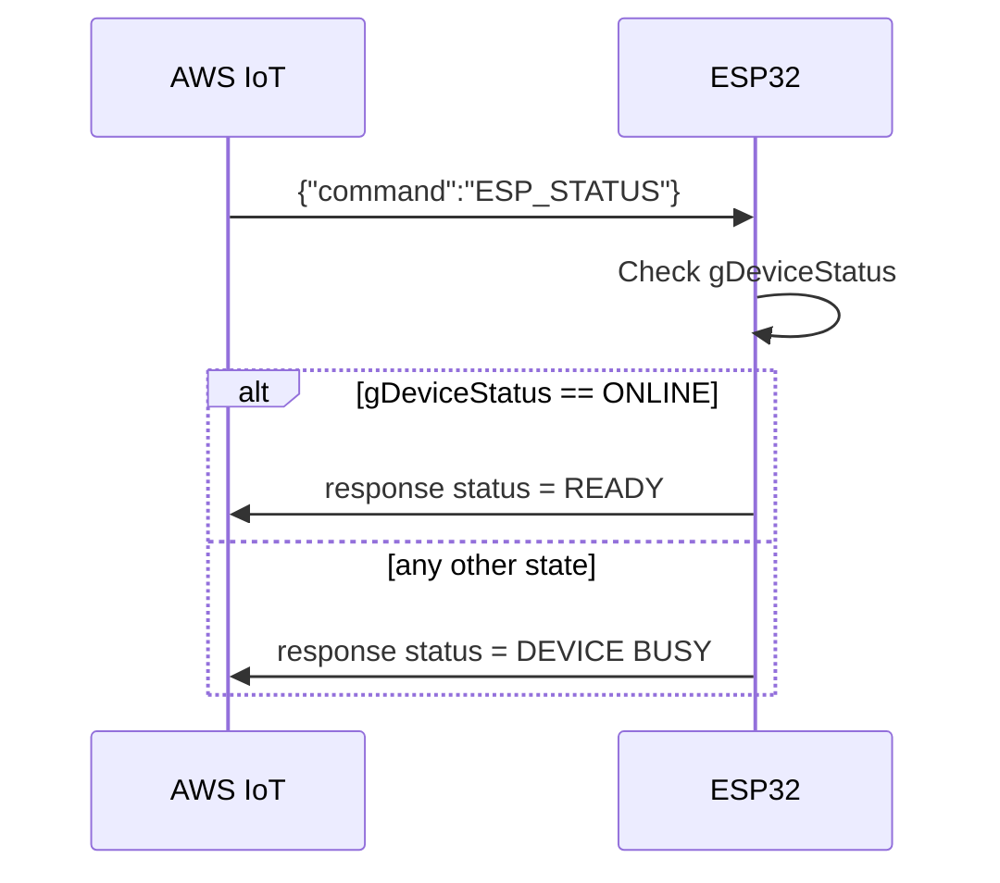

# ESP_STATUS Check and Decision Process

## Purpose

This document defines the current implementation behavior of the `ESP_STATUS` remote command.

It explains:

- where the command is handled
- what condition is evaluated
- when the firmware returns `READY`
- when the firmware returns `DEVICE BUSY`
- how this differs from the command-gating logic used by other commands

This is intended as a handoff guide for another project that must reproduce the same runtime behavior.

## Command Format

Incoming MQTT payload:

```json
{ "command": "ESP_STATUS" }
```

No parameter is required.

## Where the Logic Lives

The decision is handled in the AWS remote command callback:

- File: `AWS.cpp`
- Function: `aws_defaultRemoteCommandCallback(...)`

The `ESP_STATUS` branch returns immediately after publishing a response.

## Core Decision Rule

The implemented rule is strict and simple:

- If `gDeviceStatus == ONLINE` -> return `READY`
- Else -> return `DEVICE BUSY`

In pseudocode:

```text
if command == ESP_STATUS:
    if gDeviceStatus != ONLINE:
        status = "DEVICE BUSY"
    else:
        status = "READY"
    publish response and return
```

## MQTT Response Shape

The response is sent by `AWS_sendCommandResponse(...)` with:

- `command = "ESP_STATUS"`
- `status = "READY"` or `"DEVICE BUSY"`

Typical JSON form:

```json
{
  "mac": "30:ED:A0:15:6D:98",
  "type": "response",
  "timestamp": "2026-04-06T18:51:07Z",
  "command": "ESP_STATUS",
  "mode": "DEV",
  "status": "READY"
}
```

or

```json
{
  "mac": "30:ED:A0:15:6D:98",
  "type": "response",
  "timestamp": "2026-04-06T18:51:07Z",
  "command": "ESP_STATUS",
  "mode": "DEV",
  "status": "DEVICE BUSY"
}
```

## State Machine Context

`gDeviceStatus` is the global state machine enum. `ONLINE` is only one specific state among many.

Important point:

- `ESP_STATUS` does not check provisioning flags directly.
- `ESP_STATUS` does not check Wi-Fi/AWS booleans directly.
- It only checks whether the current state enum equals `ONLINE`.

So even if some subsystems appear healthy, if state is not exactly `ONLINE`, response is `DEVICE BUSY`.

## Practical Interpretation

### Returns READY when

- state machine has already entered `ONLINE`
- common route is through UI idle transition where provisioned devices are placed into `ONLINE`
- some completion paths also explicitly set `gDeviceStatus = ONLINE`

### Returns DEVICE BUSY when

Any state other than `ONLINE`, including (not exhaustive):

- `STARTING`
- `INITIALIZING`
- `BLEBROADCASTING`
- `UNPROVISIONED`
- `UNPROVISIONEDSTART`
- `PROVISIONING`
- `UPDATEMANAGER`
- `FIRMWAREDOWNLOADING`
- `FIRMWARETRANSFERTOSTM`
- `ASSETDOWNLOADING`
- `NO_WIFI`
- `NO_INTERNET`
- `NO_AWS`
- `TESTWIFI`
- `WELCOME_WAIT`
- `ALERT_DISPLAY`
- `UNDER_STM32_CONTROL`

## Decision Table

| Condition | Response status |
|---|---|
| `gDeviceStatus == ONLINE` | `READY` |
| `gDeviceStatus != ONLINE` | `DEVICE BUSY` |

## Important Difference from Other Command Gating

For many other remote commands, there is an additional gate later in the callback:

```text
if gDeviceStatus != PROVISIONED and gDeviceStatus != ONLINE:
    return DEVICE BUSY
```

That means some commands are allowed in either `PROVISIONED` or `ONLINE`.

`ESP_STATUS` is different:

- it is evaluated earlier
- it returns immediately
- it only treats `ONLINE` as ready

Therefore:

- `PROVISIONED` state is still reported as `DEVICE BUSY` for `ESP_STATUS`

## Sequence Overview



## Compatibility Contract for Another Project

To remain behavior-compatible with current firmware:

1. Implement `ESP_STATUS` with no parameters.
2. Evaluate only one condition: `state == ONLINE`.
3. Return `READY` only in `ONLINE`.
4. Return `DEVICE BUSY` for every other state.
5. Publish result using the standard command response format (`type = response`, `command = ESP_STATUS`).

## Summary

Current implementation treats `ESP_STATUS` as a strict readiness probe for the single state `ONLINE`.

- `ONLINE` -> `READY`
- everything else -> `DEVICE BUSY`

This is intentionally stricter than some other command gates in the same callback.