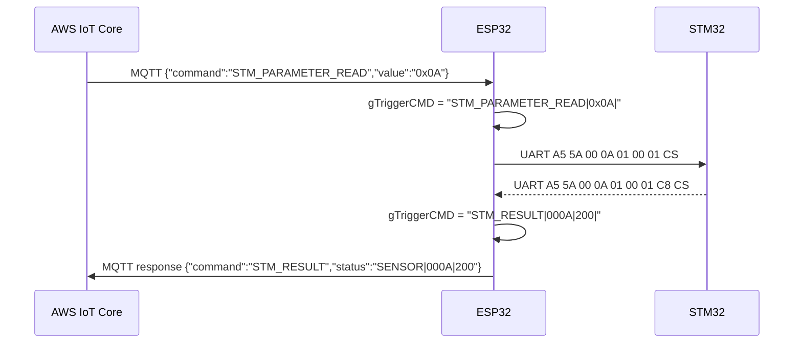
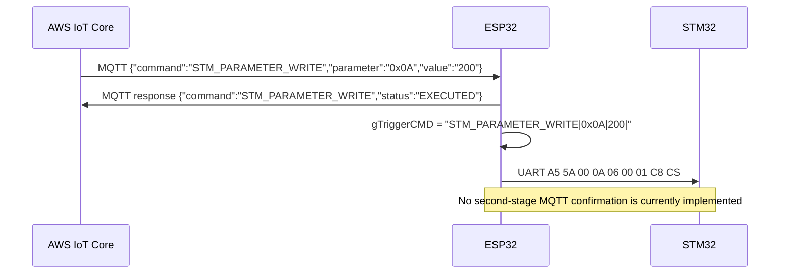

# STM Parameter Read/Write Working Process

## Purpose

This document describes the current working implementation used by this ESP32 project for:

- Receiving remote parameter read/write commands from AWS IoT Core over MQTT
- Translating those commands into UART frames for the STM32
- Parsing STM32 UART responses on the ESP32 side
- Publishing the final result back to AWS IoT Core

This document is intended for another ESP-IDF project that must follow the same behavior and remain wire-compatible with the current system.

## Scope

This document covers only the two command families below:

- `STM_PARAMETER_WRITE`
- `STM_PARAMETER_READ`

It also documents the current implementation quirks, including places where behavior is asymmetric or incomplete.

## High-Level Architecture

The implemented end-to-end path is:

1. AWS IoT Core publishes a JSON command to the device command topic.
2. ESP32 receives the MQTT command in the AWS callback.
3. ESP32 converts the command into an internal trigger string stored in `gTriggerCMD`.
4. The main loop consumes `gTriggerCMD` and sends a UART command frame to the STM32.
5. For `STM_PARAMETER_READ`, ESP32 asynchronously waits for a UART response from STM32.
6. When the STM32 response is parsed, ESP32 creates a new internal trigger.
7. The main loop converts that trigger into a final MQTT `response` message and publishes it to AWS IoT Core.

The actual path for reads is:

`AWS -> ESP32 MQTT callback -> gTriggerCMD -> UART to STM32 -> UART response from STM32 -> gTriggerCMD -> MQTT response to AWS`

The current path for writes is shorter:

`AWS -> ESP32 MQTT callback -> immediate MQTT ACK -> gTriggerCMD -> UART to STM32`

There is currently no verified second-stage STM32 write-confirmation message published back to AWS.

## MQTT Topics

### Command Subscription Topic

The device listens on:

`foodcycle/{mac}/command`

Examples observed in source comments:

- `foodcycle/30:ED:A0:15:6D:A4/command`
- `foodcycle/30:ED:A0:A7:D9:84/command`

Note that the current implementation uses `gSYSTEM_MAC` directly for `subscribedMac`, so the topic uses the raw MAC string as currently stored by the firmware.

### Response Publish Topic

The command response topic is currently:

`fc75/tx/response`

Important current behavior:

- Heartbeat publishing switches between prod and dev topics.
- `AWS_sendCommandResponse()` does not currently switch to `fc75/dev/response`.
- It always publishes to `config::PATHS::AWS_RESPONSE`, which is `fc75/tx/response`.

If another project must be fully compatible with current behavior, it should publish command responses to `fc75/tx/response`.

## Incoming MQTT Command Formats

### 1. Parameter Write Command

```json
{ "command": "STM_PARAMETER_WRITE", "parameter": "0x0A", "value": "200" }
```

Field meanings:

- `command`: fixed string `STM_PARAMETER_WRITE`
- `parameter`: register/address to write, represented as a string and parsed as hexadecimal
- `value`: 8-bit value to write, represented as a string and converted to integer by the ESP32

### 2. Parameter Read Command

```json
{ "command": "STM_PARAMETER_READ", "value": "0x0A" }
```

Field meanings:

- `command`: fixed string `STM_PARAMETER_READ`
- `value`: register/address to read, represented as a string and parsed as hexadecimal

Important compatibility note:

- For reads, the address is carried in the `value` field, not in `parameter`.
- This is not symmetrical with the write command.
- Another project should preserve this if compatibility with the current cloud sender is required.

## Current ESP32 Processing Flow

## Step 1. MQTT Receive and JSON Parse

The AWS callback parses the incoming JSON payload and normalizes `command` to uppercase.

### Write command behavior

When `STM_PARAMETER_WRITE` is received:

1. ESP32 immediately publishes a command response with status `EXECUTED`.
2. ESP32 stores an internal trigger string:

```text
STM_PARAMETER_WRITE|<parameter>|<value>|
```

Example:

```text
STM_PARAMETER_WRITE|0x0A|200|
```

This means the MQTT ACK happens before the UART write has been verified by STM32.

### Read command behavior

When `STM_PARAMETER_READ` is received:

1. ESP32 does not send an immediate `EXECUTED` ACK.
2. ESP32 stores an internal trigger string:

```text
STM_PARAMETER_READ|<address>|
```

Example:

```text
STM_PARAMETER_READ|0x0A|
```

The final MQTT response for reads is only sent after the STM32 response is parsed or a timeout occurs.

## Step 2. Internal Trigger Dispatch

The main loop repeatedly calls `TRIGGERS_process()`, which interprets `gTriggerCMD`.

Relevant trigger handling:

- `STM_PARAMETER_WRITE` -> `myhardware.writeSensorData(tokens[1], tokens[2].toInt())`
- `STM_PARAMETER_READ` -> `myhardware.readSensorData(tokens[1])`
- `STM_RESULT` -> build payload and call `AWS_sendCommandResponse()`

Internal trigger transport is string-based and uses `|` as the field separator.

## UART Protocol Used Between ESP32 and STM32

## Important Note

This is not standard Modbus RTU.

It is a custom Modbus-like frame format with:

- fixed header bytes `0xA5 0x5A`
- 16-bit address
- simple function code
- 16-bit payload length field
- XOR checksum

Differences from standard Modbus RTU include:

- no slave address byte
- no CRC16
- custom header bytes
- XOR checksum instead of Modbus CRC

Another project must reproduce this exact framing if it wants to remain compatible with the existing STM32 firmware.

## UART Write Frame Format

For `STM_PARAMETER_WRITE`, the ESP32 sends this frame:

```text
[0]  0xA5          header 1
[1]  0x5A          header 2
[2]  AddrH         address high byte
[3]  AddrL         address low byte
[4]  0x06          function code: write
[5]  0x00          data length high byte
[6]  0x01          data length low byte
[7]  Value         one-byte value to write
[8]  XOR           XOR of bytes 0..7
```

Length: 9 bytes total.

### Example

If the command is:

```json
{ "command": "STM_PARAMETER_WRITE", "parameter": "0x0A", "value": "200" }
```

Then the address parsed by the firmware is `0x000A`, and the value byte is `0xC8`.

The UART frame becomes:

```text
A5 5A 00 0A 06 00 01 C8 CS
```

Where `CS` is the XOR of all previous bytes.

## UART Read Frame Format

For `STM_PARAMETER_READ`, the ESP32 sends this frame:

```text
[0]  0xA5          header 1
[1]  0x5A          header 2
[2]  AddrH         address high byte
[3]  AddrL         address low byte
[4]  0x01          function code: read
[5]  0x00          data length high byte
[6]  0x01          data length low byte
[7]  XOR           XOR of bytes 0..6
```

Length: 8 bytes total.

### Example

If the command is:

```json
{ "command": "STM_PARAMETER_READ", "value": "0x0A" }
```

Then the UART frame becomes:

```text
A5 5A 00 0A 01 00 01 CS
```

Where `CS` is the XOR of all previous bytes.

## STM32 Read Response Expected by ESP32

The ESP32 currently expects a read response frame in this format:

```text
[0]  0xA5          header 1
[1]  0x5A          header 2
[2]  AddrH         address high byte
[3]  AddrL         address low byte
[4]  0x01          function code: read response
[5]  0x00          data length high byte
[6]  0x01          data length low byte
[7]  Data          one-byte parameter value
[8]  XOR           XOR of bytes 0..7
```

Length: 9 bytes total.

The parser currently validates:

- header must be `A5 5A`
- returned address must match the pending read address
- function code must be `0x01`
- length must be `0x0001`

Checksum handling is tolerant:

- the XOR checksum is checked
- if it does not match, a warning is printed
- the frame is still accepted

This means current firmware prioritizes availability over strict checksum rejection for parameter reads.

## Read State Machine on the ESP32

After sending a read frame, the ESP32 stores:

- `pendingSensorRead = true`
- `pendingSensorAddr = <parsed address>`
- `sensorReadStartMs = millis()`

Then on every `myhardware.loop()` cycle, the ESP32 calls the non-blocking parser for read responses.

### If STM32 returns a valid response

The ESP32 extracts the value byte and creates:

```text
STM_RESULT|<ADDR_HEX_4_DIGITS>|<VALUE_DECIMAL>|
```

Example:

```text
STM_RESULT|000A|200|
```

### If STM32 does not respond before timeout

The ESP32 creates:

```text
STM_RESULT|<ADDR_HEX_4_DIGITS>|TIMEOUT|
```

Example:

```text
STM_RESULT|000A|TIMEOUT|
```

This trigger is then handled by `TRIGGERS_process()` in a later loop iteration.

## Final MQTT Response Sent Back to AWS

When `TRIGGERS_process()` receives `STM_RESULT`, it builds a payload string in this format:

```text
SENSOR|<ADDR>|<VALUE_OR_TIMEOUT>
```

Examples:

```text
SENSOR|000A|200
SENSOR|000A|TIMEOUT
```

Then it publishes a command response using:

- `command = "STM_RESULT"`
- `status = "SENSOR|000A|200"`

### Actual MQTT JSON format

```json
{
  "mac": "30:ED:A0:15:6D:98",
  "type": "response",
  "timestamp": "2026-04-06T12:34:56Z",
  "command": "STM_RESULT",
  "mode": "PROD",
  "status": "SENSOR|000A|200"
}
```

### Important compatibility note

The final read result does not come back as:

```json
{ "command": "STM_PARAMETER_READ", ... }
```

Instead it comes back as:

```json
{ "command": "STM_RESULT", "status": "SENSOR|000A|200" }
```

Any compatible ESP-IDF implementation must preserve this behavior if downstream cloud services already depend on it.

## Write Response Behavior in Current Implementation

Current implementation for writes is different from reads.

### What happens today

When `STM_PARAMETER_WRITE` is received from AWS:

1. ESP32 immediately publishes:

```json
{
  "type": "response",
  "command": "STM_PARAMETER_WRITE",
  "status": "EXECUTED"
}
```

2. ESP32 later sends the UART write frame to the STM32.

### What does not currently happen

The current firmware does not implement:

- a `pendingSensorWrite` state
- a write-response parser from STM32
- a second MQTT response confirming actual STM32 write success
- a timeout/error response for write completion

### Practical meaning

For the current project, the `EXECUTED` response for `STM_PARAMETER_WRITE` means only:

- the ESP32 accepted the MQTT command
- the ESP32 queued or dispatched the UART write request

It does not guarantee that the STM32 actually committed the write.

If another project wants strict write confirmation, that would be a functional enhancement, not a reproduction of current behavior.

## Behavioral Differences Between Read and Write

| Item | `STM_PARAMETER_WRITE` | `STM_PARAMETER_READ` |
|---|---|---|
| Incoming MQTT field carrying address | `parameter` | `value` |
| Immediate MQTT ACK | Yes | No |
| UART frame function code | `0x06` | `0x01` |
| Wait for STM32 response | No | Yes |
| Final MQTT result after STM32 reply | No second-stage result | Yes |
| Final response command name | `STM_PARAMETER_WRITE` | `STM_RESULT` |
| Result payload location | `status = EXECUTED` | `status = SENSOR|ADDR|VALUE` |

## Recommended Compatibility Contract for Another ESP-IDF Project

To match the current firmware behavior exactly, the new project should implement the following:

1. Subscribe to `foodcycle/{mac}/command`.
2. Parse incoming JSON commands exactly as currently used.
3. Preserve the asymmetric field usage:
   - write address from `parameter`
   - read address from `value`
4. For writes:
   - immediately publish a `response` with `command = STM_PARAMETER_WRITE`
   - set `status = EXECUTED`
   - send UART write frame using function code `0x06`
5. For reads:
   - do not publish an immediate `EXECUTED` ACK
   - send UART read frame using function code `0x01`
   - wait asynchronously for the STM32 response
   - publish final `response` with `command = STM_RESULT`
   - encode the read result into the `status` field as `SENSOR|ADDR|VALUE`
   - on timeout, publish `SENSOR|ADDR|TIMEOUT`
6. Publish command responses to `fc75/tx/response` for compatibility with current code.

## Suggested Sequence Diagrams

### Read Sequence



### Write Sequence



## Known Implementation Quirks and Risks

1. Read and write do not use the same JSON field names for the parameter address.
2. Read results are returned with command name `STM_RESULT`, not `STM_PARAMETER_READ`.
3. Read result data is encoded into `status`, not into a dedicated structured JSON field.
4. Write acknowledgements are optimistic and occur before STM32 confirmation.
5. The read parser accepts a frame even if checksum validation fails.
6. Command response publishing currently uses the production response topic constant directly.

## If You Intend to Improve the Design Later

If compatibility with current production behavior is not required forever, the following would be good future improvements:

- use the same address field name for read and write commands
- return structured JSON for read results instead of overloading `status`
- use `STM_PARAMETER_READ` as the response command name for read completion
- add a verified write-response flow and timeout handling
- reject bad UART checksums instead of accepting them with warning only
- use `DEV_RESPONSE` automatically when running in dev mode

These are improvements only. They are not part of the current working contract.

## Summary

The current working implementation should be understood as follows:

- `STM_PARAMETER_READ` is a two-stage asynchronous flow ending in a MQTT `response` message with `command = STM_RESULT`.
- `STM_PARAMETER_WRITE` is currently a one-stage optimistic ACK plus UART write dispatch, with no STM32-confirmed completion response.
- The UART protocol is a custom `A5 5A` framed protocol with XOR checksum, not standard Modbus RTU.
- Another ESP-IDF project should follow this exact behavior if compatibility with existing cloud and STM32 integrations is required.